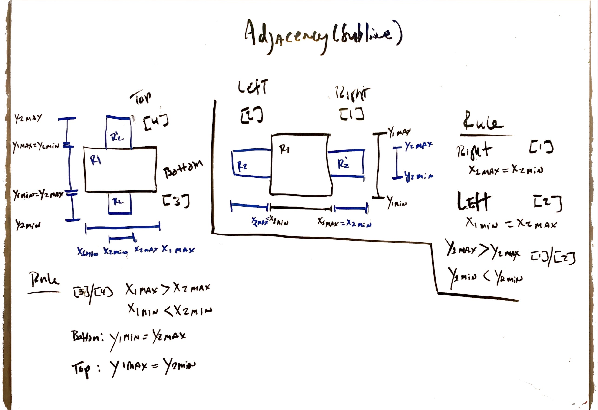

# rcal cli

The CLI allows you to analyze rectangles and features that exist among rectangles. Your implementation is required to cover
the following:

- Intersection
- Containment
- Adjacency

## Usage

```text
rcal cli calculates intersection, containment and adjacency between two rectangles.

Usage:
  rcal [command]

Available Commands:
  adjacency    calculates the adjacency between two rectangles
  containment  calculates containment between two rectangles.
  help         Help about any command
  intersection calculates the intersection between two rectangles.

Flags:
      --config string   config file (default is $HOME/.rcal.yaml)
  -h, --help            help for rcal
  -t, --toggle          Help message for toggle

Use "rcal [command] --help" for more information about a command.
```

## Intersection

### Usage

```text
$  rcal intersection -h
calculates the intersection between two rectangles.

Usage:
  rcal intersection [flags]

Flags:
  -h, --help                help for intersection
  -a, --rectangleA string   rectangle A coords BottomLeft (x,y) and Top Right (x,y) as -a 6,4,14,10 -b  4,2,7,6
  -b, --rectangleB string   rectangle B coords BottomLeft (x,y) and Top Right (x,y) as -a 6,4,14,10 -b  4,2,7,6

Global Flags:
      --config string   config file (default is $HOME/.rcal.yaml)
```

### Command
```text
$rcal intersection -a 6,4,14,10 -b 4,2,7,6
```
### Output

```text
 TopLeft        TopRight        BottomLeft      BottomRight     xMin    xMax    yMin    yMax    
 --------       --------        --------        --------        --------------------------------
 {6 10}         {14 10}         {6 4}           {14 4}          6       14      4       10      

 TopLeft        TopRight        BottomLeft      BottomRight     xMin    xMax    yMin    yMax    
 --------       --------        --------        --------        --------------------------------
 {4 6}          {7 6}           {4 2}           {7 2}           4       7       2       6       

+--------Reference--------+
+-------- Intersection in Block #1 --------+
        +-----------+
        |        R1 |
+-----------+       |
| R2        |       |
|           |-------+
+-----------+ 


*** Intersection between Rectangle A and Rectanle b ***
        Intersection in Block No. 1 : [{6 6} {7 4}]

```

### Command

```text
$ rcal intersection -a 6,4,14,10 -b 2,5,4,8
```

### Output

```text
 TopLeft        TopRight        BottomLeft      BottomRight     xMin    xMax    yMin    yMax    
 --------       --------        --------        --------        --------------------------------
 {6 10}         {14 10}         {6 4}           {14 4}          6       14      4       10      

 TopLeft        TopRight        BottomLeft      BottomRight     xMin    xMax    yMin    yMax    
 --------       --------        --------        --------        --------------------------------
 {2 8}          {4 8}           {2 5}           {4 5}           2       4       5       8       


*** Intersection between Rectangle A and Rectanle b: None Identified ***

```

## Containment

### Usage

```text
$ rcal containment -h
calculates containment between two rectangles.

Usage:
  rcal containment [flags]

Flags:
  -h, --help                help for containment
  -a, --rectangleA string   rectangle A coords BottomLeft (x,y) and Top Right (x,y) as -a 6,4,14,10 -b  4,2,7,6
  -b, --rectangleB string   rectangle B coords BottomLeft (x,y) and Top Right (x,y) as -a 6,4,14,10 -b  4,2,7,6

Global Flags:
      --config string   config file (default is $HOME/.rcal.yaml)
```

### Command

```text
$ rcal containment -a 6,4,14,10 -b 7,6,11,8
```
### Output

```text
 TopLeft        TopRight        BottomLeft      BottomRight     xMin    xMax    yMin    yMax    
 --------       --------        --------        --------        --------------------------------
 {6 10}         {14 10}         {6 4}           {14 4}          6       14      4       10      

 TopLeft        TopRight        BottomLeft      BottomRight     xMin    xMax    yMin    yMax    
 --------       --------        --------        --------        --------------------------------
 {7 8}          {11 8}          {7 6}           {11 6}          7       11      6       8       

+--------Reference--------+
+------------ Containment -----------------+
+---------------+
|   +-------+   |
|   |   R2  |   |
|   +-------+   |
+---------------+ 


*** Containment between Rectangle A and Rectangle B: Found ***
```

### Command

```text
$ rcal containment -a 6,4,14,10 -b 4,2,7,6
```

### Output

```text
 TopLeft        TopRight        BottomLeft      BottomRight     xMin    xMax    yMin    yMax    
 --------       --------        --------        --------        --------------------------------
 {6 10}         {14 10}         {6 4}           {14 4}          6       14      4       10      

 TopLeft        TopRight        BottomLeft      BottomRight     xMin    xMax    yMin    yMax    
 --------       --------        --------        --------        --------------------------------
 {4 6}          {7 6}           {4 2}           {7 2}           4       7       2       6       

+--------Reference--------+
+-------- Intersection in Block #1 --------+
        +-----------+
        |        R1 |
+-----------+       |
| R2        |       |
|           |-------+
+-----------+ 

*** Containment between Rectangle A and Rectangle B: NOT Found ***

```

## Adjacency

### Usage

```text
$ rcal adjacency -h
calculates the adjacency between two rectangles

Usage:
  rcal adjacency [flags]

Flags:
  -h, --help                help for adjacency
  -a, --rectangleA string   rectangle A coords
  -b, --rectangleB string   rectangle B coords

Global Flags:
      --config string   config file (default is $HOME/.rcal.yaml)
```

### Command

```text
$ rcal adjacency -a 6,4,14,10 -b 6,1,14,4
```

### Output

```text
 TopLeft        TopRight        BottomLeft      BottomRight     xMin    xMax    yMin    yMax    
 --------       --------        --------        --------        --------------------------------
 {6 10}         {14 10}         {6 4}           {14 4}          6       14      4       10      

 TopLeft        TopRight        BottomLeft      BottomRight     xMin    xMax    yMin    yMax    
 --------       --------        --------        --------        --------------------------------
 {6 4}          {14 4}          {6 1}           {14 1}          6       14      1       4       

+--------Reference--------+
+---------- Adjacency (Proper) ------------+
+--------+
|R1      |
|        |
+--------+
| R2     |
|        |
+--------+ 


*** Adjacency between Rectangle A and Rectangle B : Proper ***

```

### Command

```text
$ rcal adjacency -a 6,4,14,10 -b 4,1,12,4
```
### Output

```text

 TopLeft        TopRight        BottomLeft      BottomRight     xMin    xMax    yMin    yMax    
 --------       --------        --------        --------        --------------------------------
 {6 10}         {14 10}         {6 4}           {14 4}          6       14      4       10      

 TopLeft        TopRight        BottomLeft      BottomRight     xMin    xMax    yMin    yMax    
 --------       --------        --------        --------        --------------------------------
 {4 4}          {12 4}          {4 1}           {12 1}          4       12      1       4       

+--------Reference--------+
+---------- Adjacency (Partial) ------------+
    +-------+
    | R2    |
    |       |
    |       |
+--------+--+
|  R1    |
|        |
|        |
+--------+ 


*** Adjacency between Rectangle A and Rectangle B : Partial ***

```

### Command

```text
rcal adjacency -a 6,4,14,10 -b 14,6,16,8
```
### Output

```text
 TopLeft        TopRight        BottomLeft      BottomRight     xMin    xMax    yMin    yMax    
 --------       --------        --------        --------        --------------------------------
 {6 10}         {14 10}         {6 4}           {14 4}          6       14      4       10      

 TopLeft        TopRight        BottomLeft      BottomRight     xMin    xMax    yMin    yMax    
 --------       --------        --------        --------        --------------------------------
 {14 8}         {16 8}          {14 6}          {16 6}          14      16      6       8       


*** Adjacency between Rectangle A and Rectangle B : Sub-line ***
```

## Notes
### Intersection

### Overview

### Block #1

### Block #2

### Block #3

### Block #4

### Block #5

### Block #6

### Block #7

### Block #8

### Block #9

### Block #10

### Block #11


### Adjacency




## Test Case(s) - Results

# Test Results

## Features Tested

- Intersection
- Adjacency
- Containment

```text
GOROOT=/usr/lib/go-1.13 #gosetup
GOPATH=/home/hugomatus/go #gosetup
/usr/lib/go-1.13/bin/go test -c -o /tmp/___go_test_github_com_hugomatus_rcal_rectangle.test github.com/hugomatus/rcal/rectangle #gosetup
/usr/lib/go-1.13/bin/go tool test2json -t /tmp/___go_test_github_com_hugomatus_rcal_rectangle.test -test.v
=== RUN   TestRectangle_PointsOfIntersection_Location_1

 TopLeft	TopRight	BottomLeft	BottomRight	xMin	xMax	yMin	yMax	
 --------	--------	--------	--------	--------------------------------
 {6 10}		{14 10}		{6 4}		{14 4}		6	14	4	10	

 TopLeft	TopRight	BottomLeft	BottomRight	xMin	xMax	yMin	yMax	
 --------	--------	--------	--------	--------------------------------
 {4 6}		{7 6}		{4 2}		{7 2}		4	7	2	6	

+--------Reference--------+
+-------- Intersection in Block #1 --------+
        +-----------+
        |        R1 |
+-----------+       |
| R2        |       |
|           |-------+
+-----------+ 
Points of Intersection: [{6 6} {7 4}]
--- PASS: TestRectangle_PointsOfIntersection_Location_1 (0.00s)
=== RUN   TestLocation_1

 TopLeft	TopRight	BottomLeft	BottomRight	xMin	xMax	yMin	yMax	
 --------	--------	--------	--------	--------------------------------
 {6 10}		{14 10}		{6 4}		{14 4}		6	14	4	10	

 TopLeft	TopRight	BottomLeft	BottomRight	xMin	xMax	yMin	yMax	
 --------	--------	--------	--------	--------------------------------
 {4 6}		{7 6}		{4 2}		{7 2}		4	7	2	6	

+--------Reference--------+
+-------- Intersection in Block #1 --------+
        +-----------+
        |        R1 |
+-----------+       |
| R2        |       |
|           |-------+
+-----------+ 
Total Points of Intersection: 2
Points of Intersection: [{6 6} {7 4}]
--- PASS: TestLocation_1 (0.00s)
=== RUN   TestLocation_2

 TopLeft	TopRight	BottomLeft	BottomRight	xMin	xMax	yMin	yMax	
 --------	--------	--------	--------	--------------------------------
 {6 10}		{14 10}		{6 4}		{14 4}		6	14	4	10	

 TopLeft	TopRight	BottomLeft	BottomRight	xMin	xMax	yMin	yMax	
 --------	--------	--------	--------	--------------------------------
 {4 8}		{8 8}		{4 6}		{8 6}		4	8	6	8	

+-------- Intersection in Block #2 --------+
        +-----------+
        |        R1 |
+-----------+       |
| R2	    |       |
+-----------+       |
        |           |
        +-----------+ 
Points of Intersection: [{6 8} {6 6}]
--- PASS: TestLocation_2 (0.00s)
=== RUN   TestLocation_3

 TopLeft	TopRight	BottomLeft	BottomRight	xMin	xMax	yMin	yMax	
 --------	--------	--------	--------	--------------------------------
 {6 10}		{14 10}		{6 4}		{14 4}		6	14	4	10	

 TopLeft	TopRight	BottomLeft	BottomRight	xMin	xMax	yMin	yMax	
 --------	--------	--------	--------	--------------------------------
 {4 12}		{8 12}		{4 8}		{8 8}		4	8	8	12	

+-------- Intersection in Block #3 --------+
+-----------+
| R2        |
|           |-------+
|           |    R1 |
+-----------+       |
        |           |
        +-----------+ 
Points of Intersection: [{6 8} {8 10}]
--- PASS: TestLocation_3 (0.00s)
=== RUN   TestLocation_4

 TopLeft	TopRight	BottomLeft	BottomRight	xMin	xMax	yMin	yMax	
 --------	--------	--------	--------	--------------------------------
 {6 10}		{14 10}		{6 4}		{14 4}		6	14	4	10	

 TopLeft	TopRight	BottomLeft	BottomRight	xMin	xMax	yMin	yMax	
 --------	--------	--------	--------	--------------------------------
 {8 12}		{10 12}		{8 8}		{10 8}		8	10	8	12	

 TopLeft	TopRight	BottomLeft	BottomRight	xMin	xMax	yMin	yMax	
 --------	--------	--------	--------	--------------------------------
 {0 0}		{14 10}		{6 4}		{0 0}		6	14	4	10	


+-------- Intersection in Block #4 --------+
     +------+
+----|R2    |-----+
|R1  |      |     |
|    +------+     |
+-----------------+ 
Points of Intersection: [{8 10} {10 10}]
--- PASS: TestLocation_4 (0.00s)

=== RUN   TestLocation_5

 TopLeft	TopRight	BottomLeft	BottomRight	xMin	xMax	yMin	yMax	
 --------	--------	--------	--------	--------------------------------
 {6 10}		{14 10}		{6 4}		{14 4}		6	14	4	10	

 TopLeft	TopRight	BottomLeft	BottomRight	xMin	xMax	yMin	yMax	
 --------	--------	--------	--------	--------------------------------
 {10 12}	{16 12}		{10 8}		{16 8}		10	16	8	12	

+--------Reference--------+
+-------- Intersection in Block #5 --------+
     +------+
+----| R2   |
|R1  |      |
|    +------+
|       |
+-------+ 
Points of Intersection: [{10 10} {14 8}]
--- PASS: TestLocation_5 (0.00s)

=== RUN   TestLocation_6

 TopLeft	TopRight	BottomLeft	BottomRight	xMin	xMax	yMin	yMax	
 --------	--------	--------	--------	--------------------------------
 {6 10}		{14 10}		{6 4}		{14 4}		6	14	4	10	

 TopLeft	TopRight	BottomLeft	BottomRight	xMin	xMax	yMin	yMax	
 --------	--------	--------	--------	--------------------------------
 {10 8}		{16 8}		{10 6}		{16 6}		10	16	6	8	


+-------- Intersection in Block #6 --------+
+-------+
|R1     |
|    +------+
|    | R2   |
|    +------+
|       |
+-------+ 
Points of Intersection: [{14 6} {14 8}]
--- PASS: TestLocation_6 (0.00s)

=== RUN   TestLocation_7

 TopLeft	TopRight	BottomLeft	BottomRight	xMin	xMax	yMin	yMax	
 --------	--------	--------	--------	--------------------------------
 {6 10}		{14 10}		{6 4}		{14 4}		6	14	4	10	

 TopLeft	TopRight	BottomLeft	BottomRight	xMin	xMax	yMin	yMax	
 --------	--------	--------	--------	--------------------------------
 {10 6}		{16 6}		{10 2}		{16 2}		10	16	2	6	

+--------Reference--------+
+-------- Intersection in Block #7 --------+
+-------+
|R1     |
|    +------+
+----| R2   |
     |      |
     +------+ 
Points of Intersection: [{10 4} {14 6}]
--- PASS: TestLocation_7 (0.00s)

=== RUN   TestLocation_8

 TopLeft	TopRight	BottomLeft	BottomRight	xMin	xMax	yMin	yMax	
 --------	--------	--------	--------	--------------------------------
 {6 10}		{14 10}		{6 4}		{14 4}		6	14	4	10	

 TopLeft	TopRight	BottomLeft	BottomRight	xMin	xMax	yMin	yMax	
 --------	--------	--------	--------	--------------------------------
 {10 6}		{12 6}		{10 2}		{12 2}		10	12	2	6	

+-------- Intersection in Block #8 --------+
+---------------+
| R1            |
|    +------+   |
+----|	R2  |---+   
     +------+
 
Points of Intersection: [{10 4} {12 4}]
--- PASS: TestLocation_8 (0.00s)
=== RUN   TestLocation_9

 TopLeft	TopRight	BottomLeft	BottomRight	xMin	xMax	yMin	yMax	
 --------	--------	--------	--------	--------------------------------
 {6 10}		{14 10}		{6 4}		{14 4}		6	14	4	10	

 TopLeft	TopRight	BottomLeft	BottomRight	xMin	xMax	yMin	yMax	
 --------	--------	--------	--------	--------------------------------
 {2 8}		{16 8}		{2 6}		{16 6}		2	16	6	8	


+-------- Intersection in Block #9 --------+
     +-------+
     | R1    |
+----------------+
| R2             |
|                |
+----------------+
     |       |
     +-------+ 
Points of Intersection: [{6 8} {14 8} {6 6} {14 6}]
--- PASS: TestLocation_9 (0.00s)
=== RUN   TestLocation_10

 TopLeft	TopRight	BottomLeft	BottomRight	xMin	xMax	yMin	yMax	
 --------	--------	--------	--------	--------------------------------
 {6 10}		{14 10}		{6 4}		{14 4}		6	14	4	10	

 TopLeft	TopRight	BottomLeft	BottomRight	xMin	xMax	yMin	yMax	
 --------	--------	--------	--------	--------------------------------
 {2 8}		{16 8}		{2 6}		{16 6}		2	16	6	8	


+-------- Intersection in Block #9 --------+
     +------+
     | R2   |
+---------------+
| R1            |
+---------------+
     |      |
     +------+ 
Points of Intersection: [{6 8} {14 8} {6 6} {14 6}]
--- PASS: TestLocation_10 (0.00s)
=== RUN   TestLocation_11

 TopLeft	TopRight	BottomLeft	BottomRight	xMin	xMax	yMin	yMax	
 --------	--------	--------	--------	--------------------------------
 {6 10}		{14 10}		{6 4}		{14 4}		6	14	4	10	

 TopLeft	TopRight	BottomLeft	BottomRight	xMin	xMax	yMin	yMax	
 --------	--------	--------	--------	--------------------------------
 {4 8}		{8 8}		{4 6}		{8 6}		4	8	6	8	

+-------- Intersection in Block #2 --------+
        +-----------+
        |        R2 |
+-----------+       |
| R1    |   |
+-----------+       |
        |           |
        +-----------+
 
Points of Intersection: [{6 8} {6 6}]
--- PASS: TestLocation_11 (0.00s)

=== RUN   TestLocation_12

 TopLeft	TopRight	BottomLeft	BottomRight	xMin	xMax	yMin	yMax	
 --------	--------	--------	--------	--------------------------------
 {6 10}		{14 10}		{6 4}		{14 4}		6	14	4	10	

 TopLeft	TopRight	BottomLeft	BottomRight	xMin	xMax	yMin	yMax	
 --------	--------	--------	--------	--------------------------------
 {8 12}		{10 12}		{8 8}		{10 8}		8	10	8	12	


+-------- Intersection in Block #4 --------+
     +------+
+----| R1   |---+
|R2  |      |   |
     +------+   |
+---------------+ 
Points of Intersection: [{8 10} {10 10}]
--- PASS: TestLocation_12 (0.00s)

=== RUN   TestLocation_13

 TopLeft	TopRight	BottomLeft	BottomRight	xMin	xMax	yMin	yMax	
 --------	--------	--------	--------	--------------------------------
 {6 10}		{14 10}		{6 4}		{14 4}		6	14	4	10	

 TopLeft	TopRight	BottomLeft	BottomRight	xMin	xMax	yMin	yMax	
 --------	--------	--------	--------	--------------------------------
 {10 8}		{16 8}		{10 6}		{16 6}		10	16	6	8	

+--------Reference--------+
+-------- Intersection in Block #6 --------+
+-------+
|R2	 |
|      +------+
|      | R1   |
|      +------+
|	 |
+-------+ 
Points of Intersection: [{14 6} {14 8}]
--- PASS: TestLocation_13 (0.00s)
=== RUN   TestLocation_14

 TopLeft	TopRight	BottomLeft	BottomRight	xMin	xMax	yMin	yMax	
 --------	--------	--------	--------	--------------------------------
 {6 10}		{14 10}		{6 4}		{14 4}		6	14	4	10	

 TopLeft	TopRight	BottomLeft	BottomRight	xMin	xMax	yMin	yMax	
 --------	--------	--------	--------	--------------------------------
 {10 6}		{12 6}		{10 2}		{12 2}		10	12	2	6	


+-------- Intersection in Block #8 --------+
+---------------+
| R2            |
|    +------+   |
+----|	R1  |---+
     +------+ 
Points of Intersection: [{10 4} {12 4}]
--- PASS: TestLocation_14 (0.00s)

=== RUN   TestNew

 TopLeft	TopRight	BottomLeft	BottomRight	xMin	xMax	yMin	yMax	
 --------	--------	--------	--------	--------------------------------
 {4 14}		{12 14}		{4 10}		{12 10}		4	12	10	14	
--- PASS: TestNew (0.00s)
=== RUN   TestLoad

 TopLeft	TopRight	BottomLeft	BottomRight	xMin	xMax	yMin	yMax	
 --------	--------	--------	--------	--------------------------------
 {6 10}		{14 10}		{6 4}		{14 4}		6	14	4	10	

 TopLeft	TopRight	BottomLeft	BottomRight	xMin	xMax	yMin	yMax	
 --------	--------	--------	--------	--------------------------------
 {4 6}		{7 6}		{4 2}		{7 2}		4	7	2	6	
--- PASS: TestLoad (0.00s)
=== RUN   TestLoadFigure

+-------- Intersection in Block #1 --------+
        +-----------+
        |        R1 |
+-----------+       |
| R2        |       |
|           |-------+
+-----------+ 
--- PASS: TestLoadFigure (0.00s)
=== RUN   TestRectangle_Containment_1

 TopLeft	TopRight	BottomLeft	BottomRight	xMin	xMax	yMin	yMax	
 --------	--------	--------	--------	--------------------------------
 {6 10}		{14 10}		{6 4}		{14 4}		6	14	4	10	

 TopLeft	TopRight	BottomLeft	BottomRight	xMin	xMax	yMin	yMax	
 --------	--------	--------	--------	--------------------------------
 {4 6}		{7 6}		{4 2}		{7 2}		4	7	2	6	


+-------- Intersection in Block #1 --------+
        +-----------+
        |        R1 |
+-----------+       |
| R2        |       |
|           |-------+
+-----------+ 
--- PASS: TestRectangle_Containment_1 (0.00s)
=== RUN   TestRectangle_Containment_2

 TopLeft	TopRight	BottomLeft	BottomRight	xMin	xMax	yMin	yMax	
 --------	--------	--------	--------	--------------------------------
 {6 10}		{14 10}		{6 4}		{14 4}		6	14	4	10	

 TopLeft	TopRight	BottomLeft	BottomRight	xMin	xMax	yMin	yMax	
 --------	--------	--------	--------	--------------------------------
 {4 8}		{8 8}		{4 6}		{8 6}		4	8	6	8	


+-------- Intersection in Block #2 --------+
        +-----------+
        |        R1 |
+-----------+       |
| R2    |           |
+-----------+       |
        |           |
        +-----------+ 
--- PASS: TestRectangle_Containment_2 (0.00s)
=== RUN   TestRectangle_Containment_4

 TopLeft	TopRight	BottomLeft	BottomRight	xMin	xMax	yMin	yMax	
 --------	--------	--------	--------	--------------------------------
 {6 10}		{14 10}		{6 4}		{14 4}		6	14	4	10	

 TopLeft	TopRight	BottomLeft	BottomRight	xMin	xMax	yMin	yMax	
 --------	--------	--------	--------	--------------------------------
 {8 12}		{10 12}		{8 8}		{10 8}		8	10	8	12	


+-------- Intersection in Block #4 --------+
     +------+
+----| R2   |---+
|R1  |      |   |
|    +------+   |
+---------------+ 
--- PASS: TestRectangle_Containment_4 (0.00s)

=== RUN   TestRectangle_Containment_15

 TopLeft	TopRight	BottomLeft	BottomRight	xMin	xMax	yMin	yMax	
 --------	--------	--------	--------	--------------------------------
 {6 10}		{14 10}		{6 4}		{14 4}		6	14	4	10	

 TopLeft	TopRight	BottomLeft	BottomRight	xMin	xMax	yMin	yMax	
 --------	--------	--------	--------	--------------------------------
 {7 8}		{11 8}		{7 6}		{11 6}		7	11	6	8	


+------------ Containment -----------------+
+---------------+
|   +-------+   |
|   |   R2  |   |
|   +-------+   |
+---------------+ 
--- PASS: TestRectangle_Containment_15 (0.00s)

=== RUN   TestRectangle_Adjacency_18

 TopLeft	TopRight	BottomLeft	BottomRight	xMin	xMax	yMin	yMax	
 --------	--------	--------	--------	--------------------------------
 {6 10}		{14 10}		{6 4}		{14 4}		6	14	4	10	

 TopLeft	TopRight	BottomLeft	BottomRight	xMin	xMax	yMin	yMax	
 --------	--------	--------	--------	--------------------------------
 {6 4}		{14 4}		{6 1}		{14 1}		6	14	1	4	

+---------- Adjacency (Proper) ------------+
+--------+
|R1      |
|        |
|        |
+--------+
|R2      |
|        |
|        |
+--------+ 
--- PASS: TestRectangle_Adjacency_18 (0.00s)
=== RUN   TestRectangle_Adjacency_19

 TopLeft	TopRight	BottomLeft	BottomRight	xMin	xMax	yMin	yMax	
 --------	--------	--------	--------	--------------------------------
 {6 10}		{14 10}		{6 4}		{14 4}		6	14	4	10	

 TopLeft	TopRight	BottomLeft	BottomRight	xMin	xMax	yMin	yMax	
 --------	--------	--------	--------	--------------------------------
 {6 4}		{14 4}		{6 1}		{14 1}		6	14	1	4	


+---------- Adjacency (Proper) ------------+
+--------+
|R2      |
|        |
|        |
+--------+
|R1      |
|        |
|        |
+--------+ 
--- PASS: TestRectangle_Adjacency_19 (0.00s)

=== RUN   TestRectangle_Adjacency_20

 TopLeft	TopRight	BottomLeft	BottomRight	xMin	xMax	yMin	yMax	
 --------	--------	--------	--------	--------------------------------
 {6 10}		{14 10}		{6 4}		{14 4}		6	14	4	10	

 TopLeft	TopRight	BottomLeft	BottomRight	xMin	xMax	yMin	yMax	
 --------	--------	--------	--------	--------------------------------
 {4 4}		{12 4}		{4 1}		{12 1}		4	12	1	4	


+---------- Adjacency (Partial) ------------+
    +-------+
    | R2    |
    |       |
    |       |
+--------+--+
|  R1    |
|        |
|        |
+--------+ 
--- PASS: TestRectangle_Adjacency_20 (0.00s)

=== RUN   TestRectangle_Adjacency_21

 TopLeft	TopRight	BottomLeft	BottomRight	xMin	xMax	yMin	yMax	
 --------	--------	--------	--------	--------------------------------
 {6 10}		{14 10}		{6 4}		{14 4}		6	14	4	10	

 TopLeft	TopRight	BottomLeft	BottomRight	xMin	xMax	yMin	yMax	
 --------	--------	--------	--------	--------------------------------
 {8 4}		{16 4}		{8 1}		{16 1}		8	16	1	4	


+---------- Adjacency (Partial) ------------+
+-------+
| R1    |
|       |
|       |
+----+-------+
     | R2    |
     |       |
     |       |
     +-------+    
--- PASS: TestRectangle_Adjacency_21 (0.00s)

=== RUN   TestRectangle_Adjacency_22

 TopLeft	TopRight	BottomLeft	BottomRight	xMin	xMax	yMin	yMax	
 --------	--------	--------	--------	--------------------------------
 {6 10}		{14 10}		{6 4}		{14 4}		6	14	4	10	

 TopLeft	TopRight	BottomLeft	BottomRight	xMin	xMax	yMin	yMax	
 --------	--------	--------	--------	--------------------------------
 {4 14}		{12 14}		{4 10}		{12 10}		4	12	10	14	

+---------- Adjacency (Partial) ------------+
+--------+
|R2      |
|        |
|        |
+----+-------+
     | R1    |
     |       |
     |       |
     +-------+ 
--- PASS: TestRectangle_Adjacency_22 (0.00s)

=== RUN   TestRectangle_Adjacency_23

 TopLeft	TopRight	BottomLeft	BottomRight	xMin	xMax	yMin	yMax	
 --------	--------	--------	--------	--------------------------------
 {6 10}		{14 10}		{6 4}		{14 4}		6	14	4	10	

 TopLeft	TopRight	BottomLeft	BottomRight	xMin	xMax	yMin	yMax	
 --------	--------	--------	--------	--------------------------------
 {8 14}		{16 14}		{8 10}		{16 10}		8	16	10	14	

+--------Reference--------+
+---------- Adjacency (Partial) ------------+
    +-------+
    | R2    |
    |       |
    |       |
+--------+--+
|  R1    |
|        |
|        |
+--------+ 
--- PASS: TestRectangle_Adjacency_23 (0.00s)
=== RUN   TestRectangle_Adjacency_24

 TopLeft	TopRight	BottomLeft	BottomRight	xMin	xMax	yMin	yMax	
 --------	--------	--------	--------	--------------------------------
 {6 10}		{14 10}		{6 4}		{14 4}		6	14	4	10	

 TopLeft	TopRight	BottomLeft	BottomRight	xMin	xMax	yMin	yMax	
 --------	--------	--------	--------	--------------------------------
 {14 8}		{16 8}		{14 6}		{16 6}		14	16	6	8	
--- PASS: TestRectangle_Adjacency_24 (0.00s)
=== RUN   TestRectangle_Adjacency_25

 TopLeft	TopRight	BottomLeft	BottomRight	xMin	xMax	yMin	yMax	
 --------	--------	--------	--------	--------------------------------
 {6 10}		{14 10}		{6 4}		{14 4}		6	14	4	10	

 TopLeft	TopRight	BottomLeft	BottomRight	xMin	xMax	yMin	yMax	
 --------	--------	--------	--------	--------------------------------
 {8 8}		{6 8}		{8 6}		{6 6}		8	6	6	8	
--- PASS: TestRectangle_Adjacency_25 (0.00s)
=== RUN   TestRectangle_Adjacency_26

 TopLeft	TopRight	BottomLeft	BottomRight	xMin	xMax	yMin	yMax	
 --------	--------	--------	--------	--------------------------------
 {6 10}		{14 10}		{6 4}		{14 4}		6	14	4	10	

 TopLeft	TopRight	BottomLeft	BottomRight	xMin	xMax	yMin	yMax	
 --------	--------	--------	--------	--------------------------------
 {8 4}		{10 4}		{8 2}		{10 2}		8	10	2	4	
--- PASS: TestRectangle_Adjacency_26 (0.00s)
=== RUN   TestRectangle_Adjacency_27

 TopLeft	TopRight	BottomLeft	BottomRight	xMin	xMax	yMin	yMax	
 --------	--------	--------	--------	--------------------------------
 {6 10}		{14 10}		{6 4}		{14 4}		6	14	4	10	

 TopLeft	TopRight	BottomLeft	BottomRight	xMin	xMax	yMin	yMax	
 --------	--------	--------	--------	--------------------------------
 {8 12}		{10 12}		{8 10}		{10 10}		8	10	10	12	
--- PASS: TestRectangle_Adjacency_27 (0.00s)
=== RUN   TestRectangle_Adjacency_28

 TopLeft	TopRight	BottomLeft	BottomRight	xMin	xMax	yMin	yMax	
 --------	--------	--------	--------	--------------------------------
 {6 10}		{14 10}		{6 4}		{14 4}		6	14	4	10	

 TopLeft	TopRight	BottomLeft	BottomRight	xMin	xMax	yMin	yMax	
 --------	--------	--------	--------	--------------------------------
 {7 8}		{11 8}		{7 6}		{11 6}		7	11	6	8	
--- PASS: TestRectangle_Adjacency_28 (0.00s)
=== RUN   TestRectangle_Adjacency_29

 TopLeft	TopRight	BottomLeft	BottomRight	xMin	xMax	yMin	yMax	
 --------	--------	--------	--------	--------------------------------
 {6 10}		{14 10}		{6 4}		{14 4}		6	14	4	10	

 TopLeft	TopRight	BottomLeft	BottomRight	xMin	xMax	yMin	yMax	
 --------	--------	--------	--------	--------------------------------
 {4 8}		{8 8}		{4 6}		{8 6}		4	8	6	8	
--- PASS: TestRectangle_Adjacency_29 (0.00s)
PASS

Process finished with the exit code 0

```